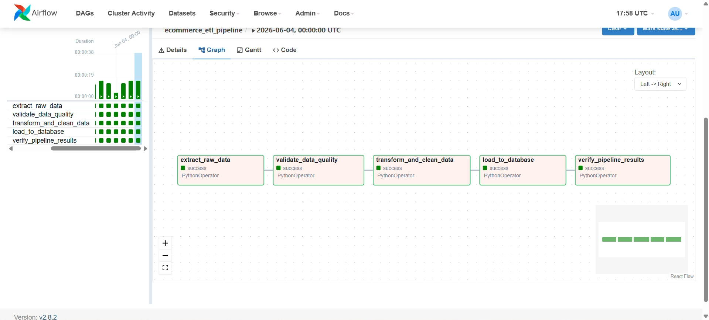

# 🛒 Enterprise Batch ETL Pipeline & Distributed Orchestration Architecture


## 📊 Functional Specification & Architectural Intent

### System Objective
This repository contains a decoupled, production-grade batch data engineering architecture. The pipeline simulates the ingestion framework of a high-volume e-commerce platform processing transactional payloads. It programmatically manages the entire lifecycle of transactional records: extracting raw payloads, executing structural validation contracts, isolating schema anomalies, computing financial data matrices, and committing pristine records into an indexed database instance.

### Data Integrity Risk Mitigation
In relational data systems, upstream anomalies (such as null identifiers, structural data-type mismatches, or negative pricing errors) propagate downstream, corrupting business intelligence layers and corporate financial reports. This system implements a defensive **Data Quality Firewall** and an automated **Orchestration Topology** utilizing Apache Airflow. It guarantees absolute data cleanliness and operational idempotency, ensuring zero production downtime even when processing corrupted input streams.

---

## 🏗️ System Architecture & Data Lineage

The data flow is engineered using a modular, single-responsibility pattern to ensure high maintainability, isolated testing bounds, and straightforward debugging cycles.

```text
  [1. EXTRACT]       ──> Programmatic Ingestion via Faker Engine
        │
        ▼
  [2. VALIDATE]      ──> Data Quality Contract Firewall
        ├── Clean Records      ──> Output: validated_data.csv
        └── Corrupt Records    ──> Isolation: quarantined_data.csv
        │
        ▼
  [3. TRANSFORM]     ──> Temporal Standardization & Revenue Compilations
        │
        ▼
  [4. LOAD]          ──> Idempotent Database Commit (SQLite)
        │
        ▼
  [5. VERIFY]        ──> Automated Transaction Audits & SQL Analytics
```

### 🎥 Orchestration Visual Topology
The workflow is containerized and managed via Apache Airflow. The system graph maps execution constraints and transactional line-items dynamically.

#### Static DAG Pipeline Architecture Matrix:


#### Live Operational Workload Execution Video:
*💡 [Click here to view the live processing video snippet](./assets/assets/airflow_dag_execution.mp4)*


*Operational Note on Scheduler Latency:* Individual Python execution loops complete in milliseconds. The visual execution layout exhibits a programmatic 3-second delay between dependent tasks. This represents intentional orchestrator overhead, capturing Airflow’s core scheduler heartbeat loop allocating containerized worker threads sequentially across the isolated environment.

🛠️ Decoupled Execution Strategy (Module Breakdown)
1. Extract Phase (generate_data.py)
Utilizes a localized configuration of the faker library to generate continuous transactional objects containing: Customer Name, Order ID, Product Category, Item Price, Timestamp, and Ingestion Platform.

Chaos Engineering Simulation: The script systematically seeds structural mutations (e.g., negative integers within financial metrics or missing unique keys) into approximately 3% of the generation stream to test system resilience.

2. Data Quality & Quarantine Firewall (quality_check.py)
Intercepts the raw data payload at the ingestion boundary. It enforces strict data validation schemas via vector boolean masking. Clear data blocks proceed through the ingestion stream, while any record breaching the contract is isolated into quarantined_data.csv for forensic engineering review, protecting the main processing thread from runtime failures.

3. Transform Phase (transform_data.py)
Ingests validated records into an in-memory pandas DataFrame structure. It converts erratic timestamp strings into ISO-8601 standardized datetime schemas, normalizes categorical string casing, and derives high-level metrics, calculating exact total_revenue values per transaction.

4. Load Phase (load_data.py)
Initializes a programmatic connection to a local structured SQLite instance (ecommerce.db). It automatically structures the destination sales table schema and manages data insertion using strict idempotent execution rules, ensuring that unintentional pipeline restarts overwrite existing state boundaries rather than duplicating entries.

5. Verification Phase (verify_data.py)
Simulates downstream analytical queries. It executes complex raw SQL calculations against the live database instance to run financial audits, report categorical performance margins, and ensure the pipeline's ledger remains perfectly balanced.

🚀 Local Deployment Lifecycle (Manual Execution)
Follow this deployment layout to establish environment isolation and execute the transactional lifecycle manually.

1. Environment Initialization & Dependency Ingestion
Open your integrated shell environment inside the project root and execute the following blocks:

Bash
# Initialize isolated Python virtual environment
python -m venv venv

# Activate execution environment
# Windows Architecture (PowerShell):
.\venv\Scripts\activate
# macOS / Linux Architectures:
source venv/bin/activate

# Ingest mandatory runtime packages
pip install pandas faker pytest

2. Purge Historical State Artifacts

To observe the ingestion lifecycle from a zero-state baseline, wipe all pre-existing database records and raw artifact files:

Remove-Item raw_sales_data.csv, quarantined_data.csv, validated_data.csv, cleaned_sales_data.csv, ecommerce.db -ErrorAction SilentlyContinue

3. Chronological Module Execution

Execute the pipeline components sequentially:
python generate_data.py       # Extract: Generates raw transaction logs
python quality_check.py       # Validate: Executes data quality firewall
python transform_data.py      # Transform: Standardizes schema & derives metrics
python load_data.py           # Load: Executes database ingestion
python verify_data.py         # Verify: Pulls raw SQL performance analytics
🐳 Containerized Orchestration & Security Infrastructure (Apache Airflow)
To scale this pipeline inside an automated deployment simulation, initialize the cluster infrastructure utilizing Docker.

1. Infrastructure Boot Sequence

Verify that your local Docker daemon is active. Then, initialize the container cluster in background detached mode:

docker-compose up -d

2. Secure Credential Extraction

The containerized infrastructure instantiates a unique security instance upon boot. To locate the dynamically generated orchestration credentials, execute the log-parsing sequence corresponding to your host operating system architecture:

Windows Environment (PowerShell):
PowerShell
docker logs ecommerce_airflow | Select-String "password"
macOS / Linux Environments (Bash/Zsh):

Bash
docker logs ecommerce_airflow | grep "password"

3. Accessing the Monitoring Console

Open your web browser and navigate to the local management node:
Plaintext
http://localhost:8080
Input admin as the username and paste the unique authentication token extracted from your system logs into the password field. Toggle the execution switch for ecommerce_etl_pipeline to visualize active state tracking.

4. Controlled Infrastructure Teardown

To cleanly terminate all running containers and reallocate host memory blocks, run:

docker-compose down


🧪 Automated Unit Regression Testing
The pipeline relies on a dedicated test suite built via the pytest framework to guarantee logic configuration stability across successive releases. To run the validation tests:

python -m pytest test_pipeline.py -v

Execution Verification Output:
test_pipeline.py::test_check_data_quality PASSED

test_pipeline.py::test_clean_sales_data PASSED